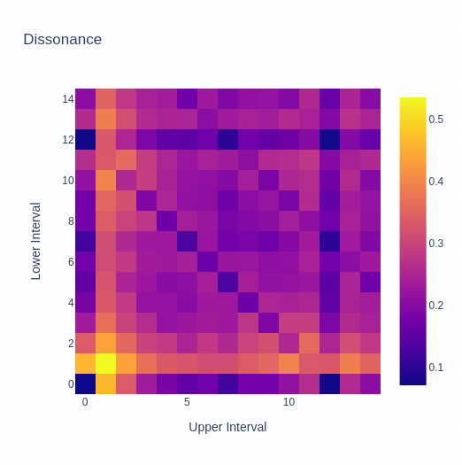
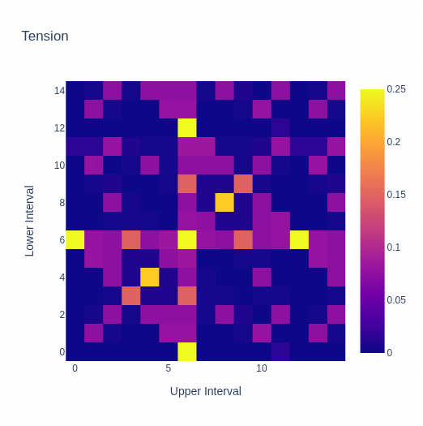
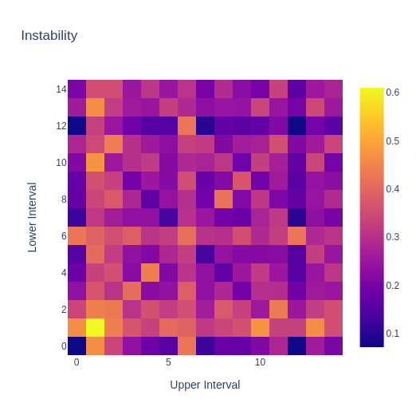

# Implementing and Testing the Instability Calculation of "Harmony Perception"

## Abstract

In 2009, Norman D. Cook introduced a mathematical model to calculate the instability
of chords [^1]. Augmented triads and chords involving the minor second are examples
for unstable chords. There was software available at some point, but since his
unfortunate passing away in 2019 [^2], it is inaccessible [^3] except for c code from
2004, which didn't contain the newer formulas from his 2009 paper [^4].

This work reviews the calculations from his paper and offers an implementation in
python, with the newer formulas, and some other changes, as will be shown later.

## Harmony Perception

Cook used a formula for the equidistance of three notes, and closeness of two notes, as
indicators for unstable chords, while also taking into account their harmonic series.
So if the dissonance of C and E was being analyzed, the model extends this, depending
on the configuration, to a chord involving the notes `C_0`, `E_0`, `C_1`, `E_1`, `G_1`,
`E_1`, and so on, while reducing the amplitudes of those overtones relative to the
original chord.

The fundamental (i.e. the input chord) and the harmonics above that are called partials.

The model would, for example, create an equidistant `C_0`, `F#_0`, `C_1`, `F#_1` chord
from the first two notes, resulting in a high "tension" rating for the tritone interval.
It iterates over each possible combination in the partials and looks if they form
equidistant chords, so it would also throw `F#_0`, `C_1`, `F#_1` into the formula, which
is equidistant as well.

The dissonance curve starts at 0 for a 0-interval, rises to its peak just
before a minor second, and then falls of slowly for larger intervals. Dips for the
perfect fourth and fifth are missing. However, when taking overtones into account and
then looking at each possible dyad in the list of partials, those dips appear.

The results for both calculations are always weighted by the product of amplitudes
of each pitch in a chord, and then summed up.

For the final instability rating, both tension and dissonance are just added together.

To visualize the results, a "triadic grid" was used. The x-axis represents the upper
interval, while the y-axis represents the lower interval in halfsteps. A C-Major chord
would have the coordinates (4, 3) in this grid, because it consists of a major third
and a minor third.

Though the grid visualizes triads, the model can be used to calculate values for chords
of arbitrary size, and for arbitrary micropitches.

## Changes

If I understood the calculation instructions in the paper correctly, the resulting
heatmap in the paper was incorrect. On page 32 of cooks paper, heatmap B[^1] is not
showing a horizontal line starting from (0, 6). However, any chord involving the tritone
should be expanded to an equidistant chord made out of two tritones, when taking upper
harmonics into account. This was corrected in thy python implementation, with good
results.

The absence of this horizontal line was possibly, because only consecutive triads
were being analyzed for equidistance. This was how it was implemented in the c-code
from 2004 [^4], and it did result in a similar plot like in the paper. This is an issue
though if a `C_0`, `E_0`, `G_0`, `G#_0` chord is being looked at, with `G_0` having a
very low amplitude. The `G_0` may be played so quietly, for whatever reason, that it is
indistinguishable from an augmented chord. But by looking only at consecutive triads,
it would miss that there is an augmented triad in there.

Problematic was the treatment of an octave interval as equidistant chord with a high
tension. For this reason, for the tension calculation, All pitches in chords were
converted to their pitch-class by calculating their modulo with 12. This causes an input
of `C_0`, `G_0`, `C_1` to be converted to `C_0`, `G_0`, which is just a perfect fifth
without an extra octave. Adding more harmonics doesn't change that, since `C_0`, `G_0`,
`C_1`, `G_1`, `D_1` is still missing an equidistant chord. This fixes the peaks also
seen in the paper,

For the dissonance calculation Eq. 1 on page 27, `β_1` was suggested to be -0.8, and
`β_2` to be -1.6, in the equation those two variables had an additional negative sign.
This was corrected in the python code.

To make chords of varying size comparable, the results were weighted. Tension results
are divided by the cubed input-chord-size, because it has a complexity of O(n³).
Similarly, for the dissonance calculation, it is divided by the squared
input-chord-size, because only every possible dyad is being looked at, instead of
every possible triad, causing a complexity of O(n²).

The c code used integer overtones[^4], which was changed to the exact harmonic series
in the python implementation.

## Results

|                                   |                             |                                     |
|-----------------------------------|-----------------------------|-------------------------------------|
|  |  |  |

Lower values in the heatmaps indicate a more pleasant sound. The "instability" heatmap
is the sum of the other two heatmaps. The major and minor triads, including their
inversions, are clearly visible as stable chords.

To verify if the updated model, which looks at every possible combination of pitches,
and not just consecutive pitches, works, automated tests were added that compare the
instability of for example a major-chord with a suspended chord. There are also tests
that compare chords of varying size with each other.

The code is available at https://github.com/sezanzeb/chord-instability

## Outlook

I wasn't confident in the modality model. Further research is needed, especially since
the modality of chords with more than 3 tones sounds very ambiguous to me, and because
the movement of voices is also a big factor. So I didn't include it here.

Ranking the instability of 4-chords was sometimes very difficult for me, so there
are hardly any tests for that.

The results of the model generally seem to make roughly sense, but it all depends on
the timbre of the actual instruments in the end. So this can only be an approximation.
For different instruments, different model configurations have to exist. For this
purpose, the function for dissonance calculation accepts at `tones` parameter, to
support arbitrary predefined amplitudes for arbitrary predefined overtones, as opposed
to generating those automatically.

A similar model might be able to calculate the dissonance in recorded music as well.
A fourier transformation could be done to get the spectrum of music, which is
then divided into frequency bands of a few cents. For each frequency band, the total
amplitude could be calculated, and then the center frequency of that band as the pitch.

[^1]: Norman D. Cook, "Harmony Perception: Harmoniousness is More Than the Sum of
Interval
Consonance", 2009, Kansai University, Takatsuki, Osaka, Japan

[^2]: "In Memory of Norman Cook", 2019, available at
https://www.infinite-energy.com/resources/norman-cook.html, accessed at 02.04.2023

[^3]: "Musical Harmony and the "Seeing Harmony" Software", archive.org, available at
https://web.archive.org/web/20170601062445/http://www.res.kutc.kansai-u.ac.jp/~cook/05%20harmony.html,
accessed at 02.04.2023

[^4]: Harmony.c March 9, 2004 N. D. Cook, T. Fujisawa and K. Takami. available at
https://web.archive.org/web/20170601052328/http://www.res.kutc.kansai-u.ac.jp/~cook/Harmony.c