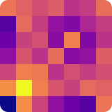

<p align="center"><p>

<h1 align="center">Chord Instability</h1>

<p align="center">Calculating instability of chords of arbitrary length</p>

<p align="center">See <a href="docs/paper.md">docs/paper.md</a> for more information.</p>

```bash
pip install git+https://github.com/sezanzeb/chord-instability
```

```python
from chordinstability import instability

# d-major
print(instability([2, 6, 9]))

# tritone
print(instability([0, 6]))

# using music21 together with this package
from music21.chord import Chord
print(instability(Chord(['C', 'C#', 'G']).pitchClasses))
```

This is based on research by Norman D. Cook [^1], [^2]

[^1]: Norman D. Cook, "Harmony Perception: Harmoniousness is More Than the Sum of
Interval Consonance", 2009, Kansai University, Takatsuki, Osaka, Japan, available
at https://web.archive.org/web/20181105084744/http://www.res.kutc.kansai-u.ac.jp/%7Ecook/PDFs/MusPerc2009.pdf
[^2]: Norman D Cook, "Visual Display of the Acoustical Properties of Harmony", CogMIR
2013, https://www.youtube.com/watch?v=CrmnaiyS5EE
